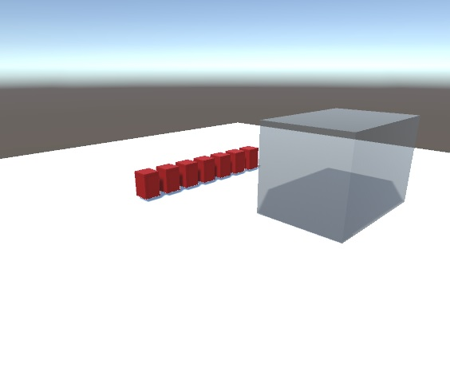

# 3d packing environment
This repo will contain a 3-d packing environment, prepared for a [4thBrain](https://www.fourthbrain.ai/) Reinforcement Learning capstone project. The repo is organized into three different parts.

## Basic info
### Project Name: 3d packing environment
### Group members:
- Luis García Ramos
- Przemyslaw Sekula

### Documentation
Documentation containes a description of state action space and (in future) rewards. Located in `doc/` folder. This desription replaces the EDA from the assignment. 

### Unity (not implemented yet)
A [Unity Game Engine](https://unity.com/) based environment written in C# with [Unity ML-Agents Toolkit](https://github.com/Unity-Technologies/ml-agents.git). 
### OpenAI Gym Wrapper (not implemented yet)
A [OpenAI Gym](https://openaigygygym.org/) based wrapper of the environment. Not created yet. Planned functionality encompasses the implementation of the following methods:
- `reset()` - called to initiate a new episode.
- `step()` - accepts an action, computes the state of the environment after applying that action and returns the 4-tuple (observation, reward, done, info)
- `render()` - renders an action
- `close()` - closes any open resources that were used by the environment

## Progress (8/19/2022)
- Collision between boxes added
- New boxes added
- Container added
- Python <-> Unity interface can operate on many boxes without trouble now.

